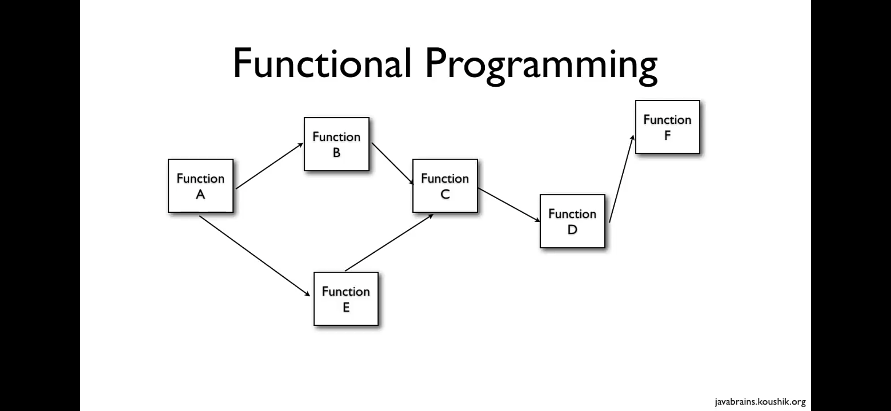
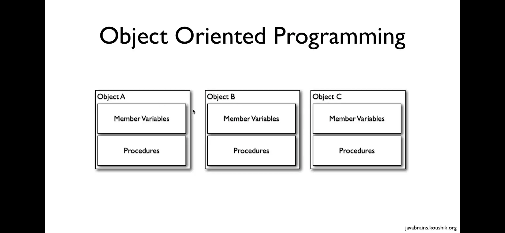
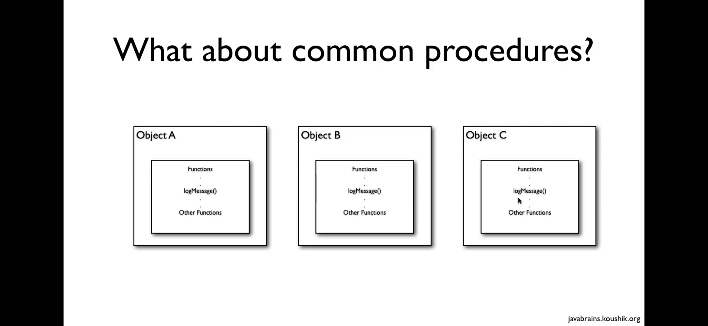
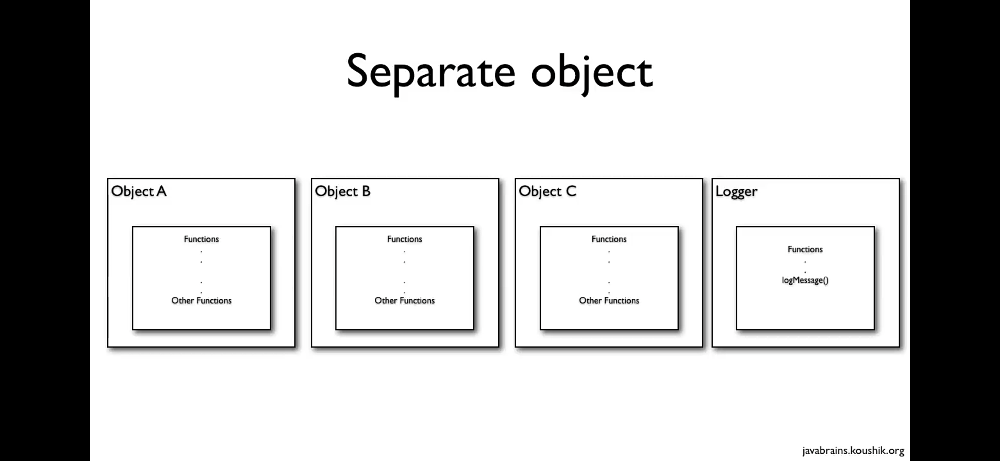
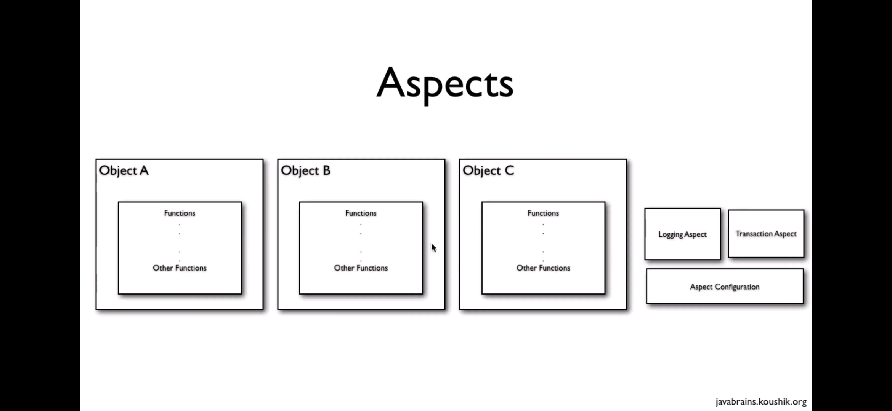
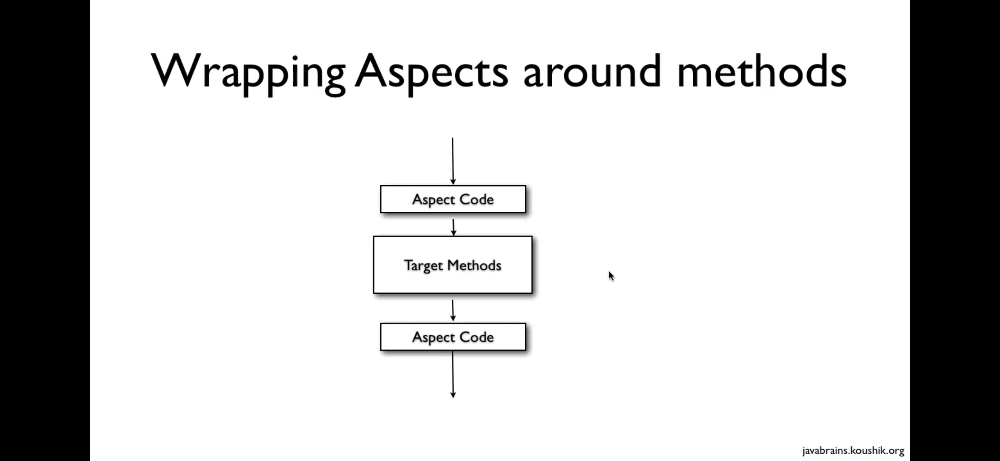

# Spring AOP (Aspect Oriented Programming)

JARs :

1. AspectJ - aspectjrt.jar & aspectjweaver.jar 
    aspectj-1.9.7.jar : https://github.com/eclipse/org.aspectj/releases/tag/V1_9_7 
    (Download JAR, extract it, aspectj-1.9.7/files/lib)

2. AOP Alliance - aopalliance-1.0.jar
    aopalliance-alpha1.jar - https://sourceforge.net/projects/aopalliance/files/latest/download

3. CGILIB - glib-3.3.0.jar
    cglib-3.3.0.jar - https://github.com/cglib/cglib/releases/tag/RELEASE_3_3_0 

4. Spring 3 ASM - asm-9.2.jar
    asm-9.2.jar - https://repository.ow2.org/nexus/content/repositories/releases/org/ow2/asm/asm/9.2/
---
 

## AOP (Aspect Oriented Programming)

Aspect Oriented Programming (AOP) compliments OOPs in the sense that it also provides modularity. But the key unit of modularity is aspect than class. AOP breaks the program logic into distinct parts (called concerns). It is used to increase modularity by cross-cutting concerns.

The functions that span multiple points of an application are called cross-cutting concerns and these cross-cutting concerns are conceptually separate from the application's business logic. There are various common good examples of aspects like logging, auditing, declarative transactions, security, caching, etc.

The key unit of modularity in OOP is the class, whereas in AOP the unit of modularity is the aspect. Dependency Injection helps you decouple your application objects from each other and AOP helps you decouple cross-cutting concerns from the objects that they affect
 

## Functional Programming Vs Object Oriented Programming

 

 

## Issues with OOPs

* What about Common Procedures  -->  Solution : create separate object

 

Issues with separate object : 
1. Too many relationships to crosscutting objects
2. Code is still required in all methods to call
3. Can not all be changed at once

therefore, AOP

## Aspects

This is a module which has a set of APIs providing cross-cutting requirements. For example, a logging module would be called AOP aspect for logging. An application can have any number of aspects depending on the requirement.

 

---

## Naming Conventions :

* aspect package
* model package
* service package
* impl package (for implementations)