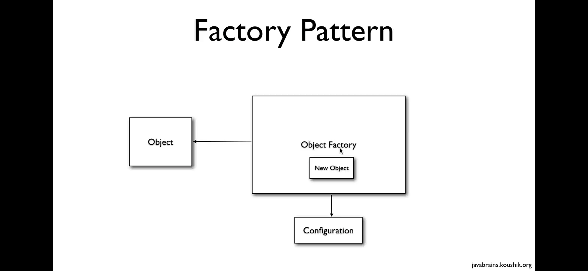
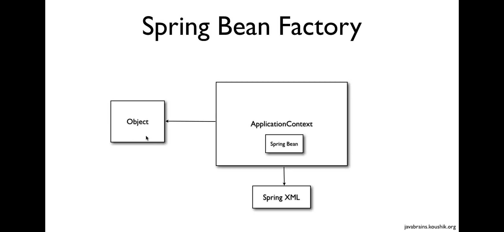
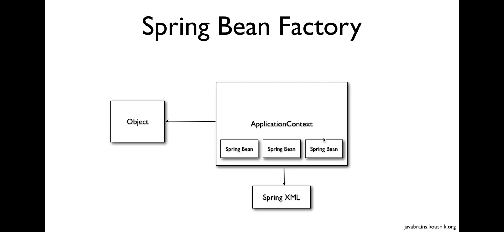

# Spring FrameWork

## Spring Bean Factory

A BeanFactory is like a factory class that contains a collection of beans. The BeanFactory holds Bean Definitions of multiple beans within itself and then instantiates the bean whenever asked for by clients. The BeanFactory is the actual container which instantiates, configures, and manages a number of beans.

### Factory Pattern & Spring Bean Factory

Working : Object factory reads configurations (blueprints of objects) and creates new objects accordingly and returns these objects to the requesting object

### ApplicationContext  

The ApplicationContext builds on top of the BeanFactory (it's a subclass) and adds other functionality such as easier integration with Springs AOP features, message resource handling (for use in internationalization), event propagation, declarative mechanisms to create the ApplicationContext and optional parent contexts, and application-layer specific contexts such as the WebApplicationContext, among other enhancements.

